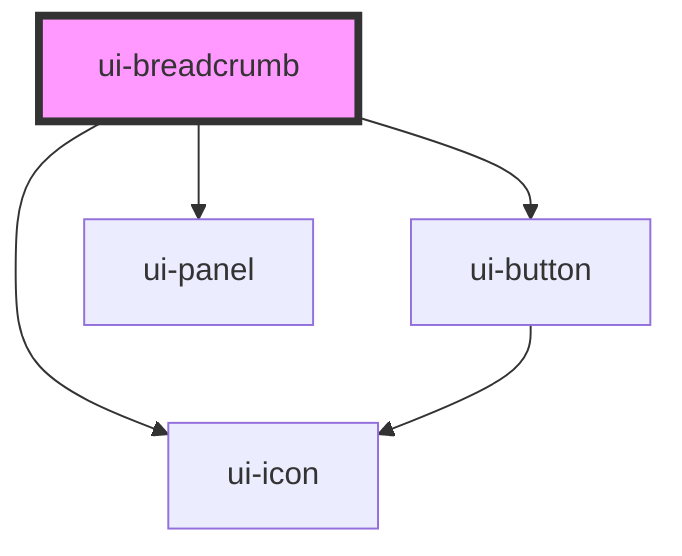

# ui-breadcrumb

<!-- Auto Generated Below -->

## Properties

| Property              | Attribute               | Description                                       | Type      | Default     |
| --------------------- | ----------------------- | ------------------------------------------------- | --------- | ----------- |
| `disabled`            | `disabled`              | Whether the breadcrumb is disabled                | `boolean` | `false`     |
| `items`               | `items`                 | Breadcrumb items as JSON string                   | `string`  | `''`        |
| `itemsAfterCollapse`  | `items-after-collapse`  | Number of items to show after collapse indicator  | `number`  | `1`         |
| `itemsBeforeCollapse` | `items-before-collapse` | Number of items to show before collapse indicator | `number`  | `1`         |
| `maxItems`            | `max-items`             | Maximum number of items before collapsing         | `string`  | `undefined` |
| `separator`           | `separator`             | Separator between items                           | `string`  | `'slash'`   |

## Events

| Event     | Description                               | Type                                 |
| --------- | ----------------------------------------- | ------------------------------------ |
| `uiClick` | Emitted when a breadcrumb item is clicked | `CustomEvent<BreadcrumbEventDetail>` |

## Dependencies

### Depends on

- [ui-button](../ui-button)
- [ui-panel](../ui-panel)
- [ui-icon](../ui-icon)

### Graph

----------------------------------------------

*Built with [StencilJS](https://stenciljs.com/)*
