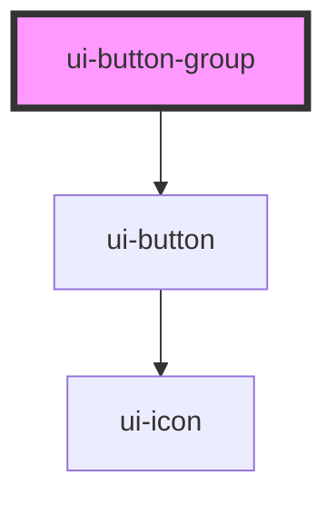

# ui-button-group

<!-- Auto Generated Below -->

## Overview

UI ButtonGroup Component
Groups buttons together with layout control and selection logic
Composes existing Button components without duplicating logic

## Properties

| Property          | Attribute           | Description                                                                                                                                                | Type                                                                                              | Default        |
| ----------------- | ------------------- | ---------------------------------------------------------------------------------------------------------------------------------------------------------- | ------------------------------------------------------------------------------------------------- | -------------- |
| `buttonAnimated`  | `button-animated`   | Whether to enable click animation on child buttons (press effect)                                                                                          | `boolean`                                                                                         | `false`        |
| `buttonFullWidth` | `button-full-width` | Whether child buttons should take full width                                                                                                               | `boolean`                                                                                         | `false`        |
| `buttonLoading`   | `button-loading`    | Whether child buttons are in loading state                                                                                                                 | `boolean`                                                                                         | `false`        |
| `buttons`         | `buttons`           | JSON string array of button objects with value, label, and optional button props If provided, buttons will be rendered automatically. Otherwise, use slot. | `string`                                                                                          | `undefined`    |
| `disabled`        | `disabled`          | Whether the entire group is disabled                                                                                                                       | `boolean`                                                                                         | `false`        |
| `fullWidth`       | `full-width`        | Whether the group takes full width                                                                                                                         | `boolean`                                                                                         | `false`        |
| `gap`             | `gap`               | Gap between buttons                                                                                                                                        | `"lg" \| "md" \| "none" \| "sm" \| "xs"`                                                          | `'md'`         |
| `orientation`     | `orientation`       | Orientation of the button group                                                                                                                            | `"horizontal" \| "vertical"`                                                                      | `'horizontal'` |
| `rounded`         | `rounded`           | Border radius size for the button group                                                                                                                    | `"2xl" \| "full" \| "lg" \| "md" \| "none" \| "sm" \| "xl"`                                       | `'md'`         |
| `segmented`       | `segmented`         | Whether buttons are segmented (no gaps, shared borders)                                                                                                    | `boolean`                                                                                         | `false`        |
| `selectionMode`   | `selection-mode`    | Selection mode for the button group                                                                                                                        | `"multiple" \| "none" \| "single"`                                                                | `'none'`       |
| `size`            | `size`              | Size inheritance for child buttons                                                                                                                         | `"default" \| "icon" \| "icon-lg" \| "icon-sm" \| "icon-xs" \| "inherit" \| "lg" \| "sm" \| "xs"` | `'inherit'`    |
| `value`           | `value`             | Current selected value(s) - For single mode: string - For multiple mode: string[] - For none mode: undefined                                               | `string \| string[]`                                                                              | `undefined`    |
| `variant`         | `variant`           | Variant inheritance for child buttons                                                                                                                      | `"default" \| "destructive" \| "ghost" \| "inherit" \| "link" \| "outline" \| "secondary"`        | `'inherit'`    |

## Events

| Event         | Description                                                              | Type                                  |
| ------------- | ------------------------------------------------------------------------ | ------------------------------------- |
| `uiChange`    | Emitted when selection changes (legacy event for backward compatibility) | `CustomEvent<ButtonGroupEventDetail>` |
| `uiClick`     | Proxy for child button click events                                      | `CustomEvent<ButtonGroupEventDetail>` |
| `valueChange` | Emitted when value changes                                               | `CustomEvent<string \| string[]>`     |

## Slots

| Slot        | Description                   |
| ----------- | ----------------------------- |
| `"default"` | Button elements to be grouped |

## Dependencies

### Depends on

- [ui-button](../ui-button)

### Graph

----------------------------------------------

*Built with [StencilJS](https://stenciljs.com/)*
