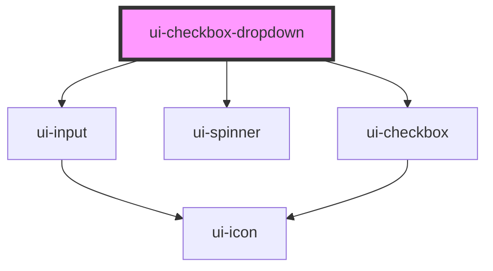

# ui-checkbox-dropdown

<!-- Auto Generated Below -->

## Properties

| Property         | Attribute         | Description | Type               | Default       |
| ---------------- | ----------------- | ----------- | ------------------ | ------------- |
| `disabled`       | `disabled`        |             | `boolean`          | `false`       |
| `errorMessage`   | `error-message`   |             | `string`           | `undefined`   |
| `label`          | `label`           |             | `string`           | `undefined`   |
| `loading`        | `loading`         |             | `boolean`          | `false`       |
| `options`        | --                |             | `DropdownOption[]` | `[]`          |
| `placeholder`    | `placeholder`     |             | `string`           | `'Select...'` |
| `required`       | `required`        |             | `boolean`          | `false`       |
| `showAvatar`     | `show-avatar`     |             | `boolean`          | `false`       |
| `showSelectAll`  | `show-select-all` |             | `boolean`          | `true`        |
| `supportingText` | `supporting-text` |             | `string`           | `undefined`   |
| `value`          | --                |             | `string[]`         | `[]`          |

## Events

| Event         | Description | Type                    |
| ------------- | ----------- | ----------------------- |
| `uiBlur`      |             | `CustomEvent<void>`     |
| `valueChange` |             | `CustomEvent<string[]>` |

## Dependencies

### Depends on

- [ui-input](../ui-input)
- [ui-spinner](../ui-spinner)
- [ui-checkbox](../ui-checkbox)

### Graph

----------------------------------------------

*Built with [StencilJS](https://stenciljs.com/)*
