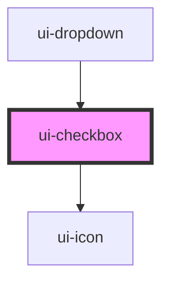

# ui-checkbox

<!-- Auto Generated Below -->

## Properties

| Property   | Attribute  | Description | Type                   | Default |
| ---------- | ---------- | ----------- | ---------------------- | ------- |
| `checked`  | `checked`  |             | `boolean`              | `false` |
| `disabled` | `disabled` |             | `boolean`              | `false` |
| `label`    | `label`    |             | `string`               | `''`    |
| `size`     | `size`     |             | `"lg" \| "md" \| "sm"` | `'md'`  |

## Events

| Event      | Description | Type                   |
| ---------- | ----------- | ---------------------- |
| `uiBlur`   |             | `CustomEvent<void>`    |
| `uiChange` |             | `CustomEvent<boolean>` |

## Dependencies

### Used by

 - [ui-dropdown](../ui-dropdown)

### Depends on

- [ui-icon](../ui-icon)

### Graph

----------------------------------------------

*Built with [StencilJS](https://stenciljs.com/)*
