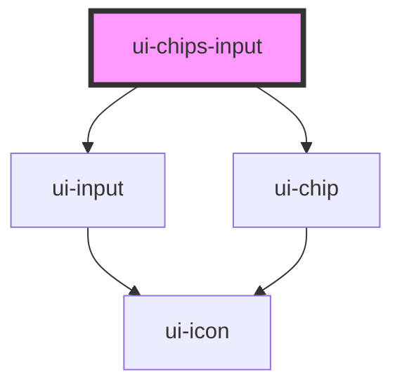

# ui-chips-input

<!-- Auto Generated Below -->

## Properties

| Property       | Attribute       | Description | Type       | Default                  |
| -------------- | --------------- | ----------- | ---------- | ------------------------ |
| `disabled`     | `disabled`      |             | `boolean`  | `false`                  |
| `errorMessage` | `error-message` |             | `string`   | `undefined`              |
| `maxChips`     | `max-chips`     |             | `number`   | `undefined`              |
| `placeholder`  | `placeholder`   |             | `string`   | `'Type and press Enter'` |
| `required`     | `required`      |             | `boolean`  | `false`                  |
| `separator`    | `separator`     |             | `string`   | `','`                    |
| `value`        | --              |             | `string[]` | `[]`                     |

## Events

| Event         | Description | Type                    |
| ------------- | ----------- | ----------------------- |
| `chipAdd`     |             | `CustomEvent<string>`   |
| `chipRemove`  |             | `CustomEvent<string>`   |
| `uiBlur`      |             | `CustomEvent<void>`     |
| `uiFocus`     |             | `CustomEvent<void>`     |
| `valueChange` |             | `CustomEvent<string[]>` |

## Methods

### `setFocus() => Promise<void>`

#### Returns

Type: `Promise<void>`

## Dependencies

### Depends on

- [ui-input](../ui-input)
- [ui-chip](../ui-chip)

### Graph

----------------------------------------------

*Built with [StencilJS](https://stenciljs.com/)*
