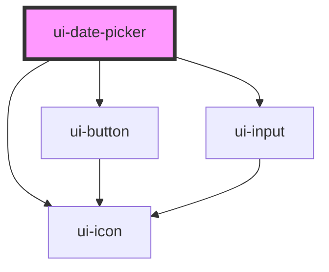

# ui-date-picker

<!-- Auto Generated Below -->

## Properties

| Property        | Attribute      | Description | Type                                  | Default                          |
| --------------- | -------------- | ----------- | ------------------------------------- | -------------------------------- |
| `customParsers` | --             |             | `DatePickerParser[]`                  | `undefined`                      |
| `debounce`      | `debounce`     |             | `number`                              | `220`                            |
| `defaultOpen`   | `default-open` |             | `boolean`                             | `false`                          |
| `defaultValue`  | --             |             | `Date \| { start: Date; end: Date; }` | `undefined`                      |
| `disabled`      | `disabled`     |             | `boolean`                             | `false`                          |
| `icon`          | `icon`         |             | `string`                              | `undefined`                      |
| `iconOnly`      | `icon-only`    |             | `boolean`                             | `false`                          |
| `label`         | `label`        |             | `string`                              | `undefined`                      |
| `loading`       | `loading`      |             | `boolean`                             | `false`                          |
| `maxDate`       | --             |             | `Date`                                | `undefined`                      |
| `minDate`       | --             |             | `Date`                                | `undefined`                      |
| `mode`          | `mode`         |             | `"range" \| "single"`                 | `'single'`                       |
| `open`          | `open`         |             | `boolean`                             | `undefined`                      |
| `placeholder`   | `placeholder`  |             | `string`                              | `'Enter date (e.g. 1 Jan 2020)'` |
| `readonly`      | `readonly`     |             | `boolean`                             | `false`                          |
| `search`        | `search`       |             | `boolean`                             | `false`                          |
| `showActions`   | `show-actions` |             | `boolean`                             | `false`                          |
| `showIcon`      | `show-icon`    |             | `boolean`                             | `true`                           |
| `value`         | --             |             | `Date \| { start: Date; end: Date; }` | `undefined`                      |

## Events

| Event            | Description | Type                                               |
| ---------------- | ----------- | -------------------------------------------------- |
| `onApply`        |             | `CustomEvent<Date \| { start: Date; end: Date; }>` |
| `onBlur`         |             | `CustomEvent<void>`                                |
| `onCancel`       |             | `CustomEvent<void>`                                |
| `onChange`       |             | `CustomEvent<Date \| { start: Date; end: Date; }>` |
| `onFocus`        |             | `CustomEvent<void>`                                |
| `onInputChange`  |             | `CustomEvent<string>`                              |
| `onInvalidInput` |             | `CustomEvent<string>`                              |
| `onOpenChange`   |             | `CustomEvent<boolean>`                             |

## Dependencies

### Depends on

- [ui-button](../ui-button)
- [ui-icon](../ui-icon)
- [ui-input](../ui-input)

### Graph

----------------------------------------------

*Built with [StencilJS](https://stenciljs.com/)*
