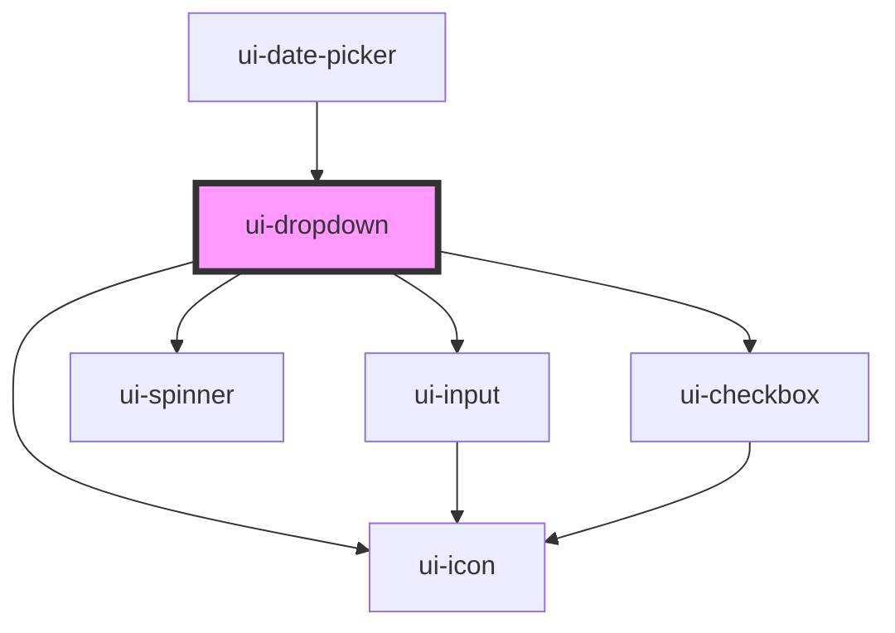

# ui-dropdown

<!-- Auto Generated Below -->

## Properties

| Property       | Attribute       | Description | Type                                 | Default       |
| -------------- | --------------- | ----------- | ------------------------------------ | ------------- |
| `clearable`    | `clearable`     |             | `boolean`                            | `false`       |
| `defaultValue` | `default-value` |             | `any`                                | `null`        |
| `disabled`     | `disabled`      |             | `boolean`                            | `false`       |
| `label`        | `label`         |             | `string`                             | `undefined`   |
| `loading`      | `loading`       |             | `boolean`                            | `false`       |
| `maxHeight`    | `max-height`    |             | `string`                             | `'300px'`     |
| `maxWidth`     | `max-width`     |             | `string`                             | `'none'`      |
| `minWidth`     | `min-width`     |             | `string`                             | `'200px'`     |
| `mode`         | `mode`          |             | `"multiple" \| "single"`             | `'single'`    |
| `open`         | `open`          |             | `boolean`                            | `undefined`   |
| `options`      | --              |             | `DropdownOption[]`                   | `[]`          |
| `placeholder`  | `placeholder`   |             | `string`                             | `'Select...'` |
| `searchable`   | `searchable`    |             | `boolean`                            | `false`       |
| `selectAll`    | `select-all`    |             | `boolean`                            | `false`       |
| `value`        | `value`         |             | `any`                                | `undefined`   |
| `variant`      | `variant`       |             | `"button" \| "icon-only" \| "input"` | `'input'`     |

## Events

| Event         | Description | Type                   |
| ------------- | ----------- | ---------------------- |
| `openChange`  |             | `CustomEvent<boolean>` |
| `search`      |             | `CustomEvent<string>`  |
| `valueChange` |             | `CustomEvent<any>`     |

## Shadow Parts

| Part       | Description |
| ---------- | ----------- |
| `"button"` |             |

## Dependencies

### Used by

 - [ui-date-picker](../ui-date-picker)

### Depends on

- [ui-input](../ui-input)
- [ui-icon](../ui-icon)
- [ui-spinner](../ui-spinner)
- [ui-checkbox](../ui-checkbox)

### Graph

----------------------------------------------

*Built with [StencilJS](https://stenciljs.com/)*
