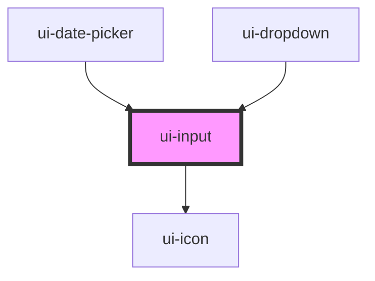

# ui-input

<!-- Auto Generated Below -->

## Properties

| Property        | Attribute         | Description | Type                           | Default               |
| --------------- | ----------------- | ----------- | ------------------------------ | --------------------- |
| `disabled`      | `disabled`        |             | `boolean`                      | `false`               |
| `icon`          | `icon`            |             | `string`                       | `undefined`           |
| `iconAriaLabel` | `icon-aria-label` |             | `string`                       | `'Input icon action'` |
| `label`         | `label`           |             | `string`                       | `undefined`           |
| `placeholder`   | `placeholder`     |             | `string`                       | `''`                  |
| `rounded`       | `rounded`         |             | `"md" \| "sm" \| "xl" \| "xs"` | `'md'`                |
| `type`          | `type`            |             | `"number" \| "text"`           | `'text'`              |
| `value`         | `value`           |             | `string`                       | `''`                  |

## Events

| Event         | Description | Type                  |
| ------------- | ----------- | --------------------- |
| `uiBlur`      |             | `CustomEvent<void>`   |
| `uiIconClick` |             | `CustomEvent<void>`   |
| `valueChange` |             | `CustomEvent<string>` |

## Dependencies

### Used by

 - [ui-date-picker](../ui-date-picker)
 - [ui-dropdown](../ui-dropdown)

### Depends on

- [ui-icon](../ui-icon)

### Graph

----------------------------------------------

*Built with [StencilJS](https://stenciljs.com/)*
