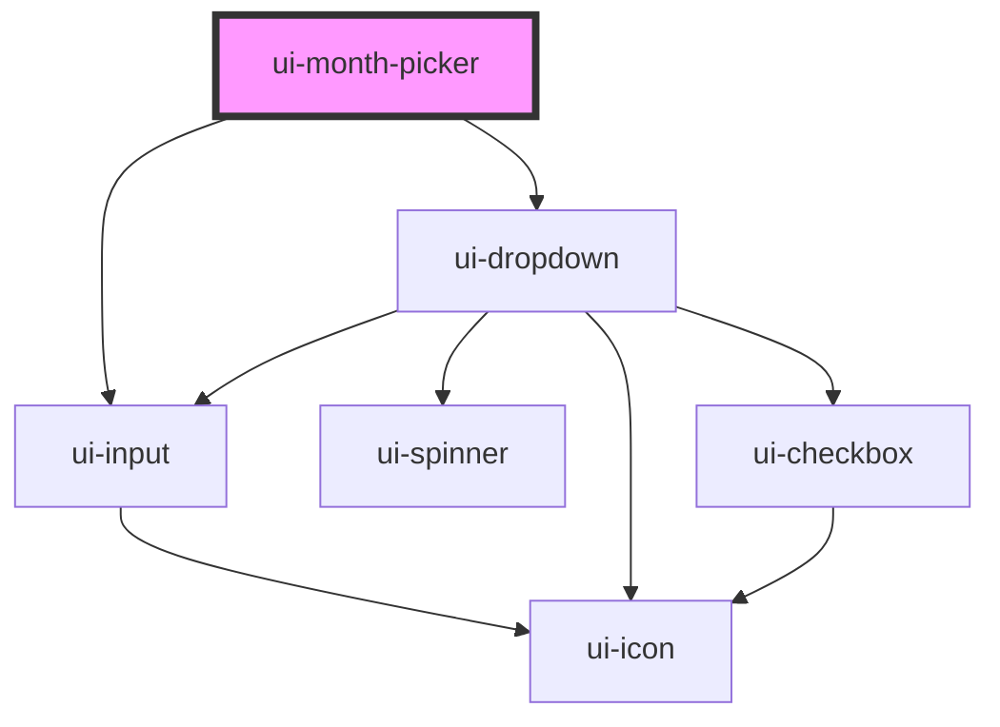

# ui-month-picker

<!-- Auto Generated Below -->

## Properties

| Property       | Attribute       | Description | Type      | Default          |
| -------------- | --------------- | ----------- | --------- | ---------------- |
| `disabled`     | `disabled`      |             | `boolean` | `false`          |
| `errorMessage` | `error-message` |             | `string`  | `undefined`      |
| `maxYear`      | `max-year`      |             | `number`  | `2100`           |
| `minYear`      | `min-year`      |             | `number`  | `2000`           |
| `placeholder`  | `placeholder`   |             | `string`  | `'Select month'` |
| `required`     | `required`      |             | `boolean` | `false`          |
| `value`        | `value`         |             | `string`  | `undefined`      |

## Events

| Event         | Description | Type                  |
| ------------- | ----------- | --------------------- |
| `valueChange` |             | `CustomEvent<string>` |

## Dependencies

### Depends on

- [ui-input](../ui-input)
- [ui-dropdown](../ui-dropdown)

### Graph

----------------------------------------------

*Built with [StencilJS](https://stenciljs.com/)*
