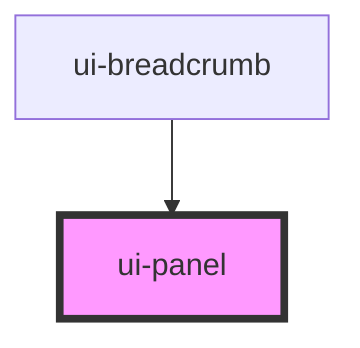

# ui-panel

<!-- Auto Generated Below -->

## Properties

| Property       | Attribute       | Description                                        | Type                                                       | Default     |
| -------------- | --------------- | -------------------------------------------------- | ---------------------------------------------------------- | ----------- |
| `collapsible`  | `collapsible`   | Whether the panel is collapsible                   | `boolean`                                                  | `false`     |
| `disabled`     | `disabled`      | Whether the panel is disabled                      | `boolean`                                                  | `false`     |
| `expanded`     | `expanded`      | Expanded state (can be controlled or uncontrolled) | `boolean`                                                  | `true`      |
| `lazy`         | `lazy`          | Renders body/footer only when expanded             | `boolean`                                                  | `false`     |
| `loading`      | `loading`       | Whether the panel is in loading state              | `boolean`                                                  | `false`     |
| `rounded`      | `rounded`       | Border radius of the panel                         | `"full" \| "lg" \| "md" \| "none" \| "sm" \| "xl" \| "xs"` | `'md'`      |
| `size`         | `size`          | Size of the panel                                  | `"lg" \| "md" \| "sm"`                                     | `'md'`      |
| `stickyHeader` | `sticky-header` | Keeps header visible while scrolling panel content | `boolean`                                                  | `false`     |
| `variant`      | `variant`       | Visual variant of the panel                        | `"default" \| "elevated" \| "outlined"`                    | `'default'` |

## Events

| Event      | Description                                                            | Type                                  |
| ---------- | ---------------------------------------------------------------------- | ------------------------------------- |
| `collapse` |                                                                        | `CustomEvent<boolean>`                |
| `expand`   |                                                                        | `CustomEvent<boolean>`                |
| `toggle`   | Emitted when panel is expanded/collapsed                               | `CustomEvent<boolean>`                |
| `uiToggle` | **[DEPRECATED]** use `toggle`   | `CustomEvent<{ expanded: boolean; }>` |

## Methods

### `collapse() => Promise<void>`

Collapse the panel

#### Returns

Type: `Promise<void>`

### `expand() => Promise<void>`

Expand the panel

#### Returns

Type: `Promise<void>`

### `toggle() => Promise<void>`

Toggle the panel expand/collapse state

#### Returns

Type: `Promise<void>`

## Dependencies

### Used by

 - [ui-breadcrumb](../ui-breadcrumb)

### Graph

----------------------------------------------

*Built with [StencilJS](https://stenciljs.com/)*
