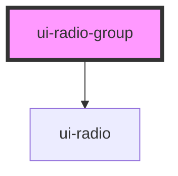

# ui-radio-group

<!-- Auto Generated Below -->

## Properties

| Property       | Attribute       | Description | Type                         | Default      |
| -------------- | --------------- | ----------- | ---------------------------- | ------------ |
| `defaultValue` | `default-value` |             | `string`                     | `''`         |
| `disabled`     | `disabled`      |             | `boolean`                    | `false`      |
| `label`        | `label`         |             | `string`                     | `undefined`  |
| `name`         | `name`          |             | `string`                     | `''`         |
| `orientation`  | `orientation`   |             | `"horizontal" \| "vertical"` | `'vertical'` |
| `radios`       | `radios`        |             | `string`                     | `undefined`  |
| `required`     | `required`      |             | `boolean`                    | `false`      |
| `size`         | `size`          |             | `"lg" \| "md" \| "sm"`       | `'md'`       |
| `value`        | `value`         |             | `string`                     | `''`         |

## Events

| Event      | Description | Type                  |
| ---------- | ----------- | --------------------- |
| `uiChange` |             | `CustomEvent<string>` |

## Dependencies

### Depends on

- [ui-radio](../ui-radio)

### Graph

----------------------------------------------

*Built with [StencilJS](https://stenciljs.com/)*
