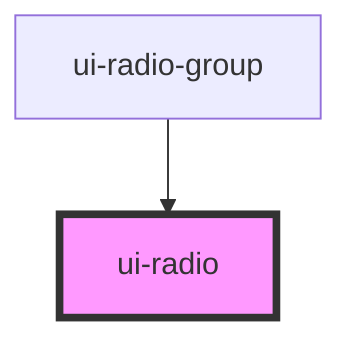

# ui-radio

<!-- Auto Generated Below -->

## Properties

| Property         | Attribute         | Description | Type                   | Default     |
| ---------------- | ----------------- | ----------- | ---------------------- | ----------- |
| `checked`        | `checked`         |             | `boolean`              | `false`     |
| `disabled`       | `disabled`        |             | `boolean`              | `false`     |
| `error`          | `error`           |             | `boolean`              | `false`     |
| `label`          | `label`           |             | `string`               | `undefined` |
| `name`           | `name`            |             | `string`               | `undefined` |
| `required`       | `required`        |             | `boolean`              | `false`     |
| `size`           | `size`            |             | `"lg" \| "md" \| "sm"` | `'md'`      |
| `supportingText` | `supporting-text` |             | `string`               | `undefined` |
| `value`          | `value`           |             | `string`               | `''`        |

## Events

| Event      | Description | Type                  |
| ---------- | ----------- | --------------------- |
| `uiBlur`   |             | `CustomEvent<void>`   |
| `uiChange` |             | `CustomEvent<string>` |
| `uiFocus`  |             | `CustomEvent<void>`   |

## Dependencies

### Used by

 - [ui-radio-group](../ui-radio-group)

### Graph

----------------------------------------------

*Built with [StencilJS](https://stenciljs.com/)*
