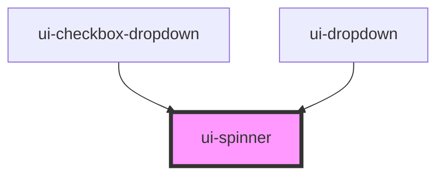

# ui-spinner

<!-- Auto Generated Below -->

## Overview

UI Spinner Component
Highly customizable loading spinner with multiple animation variants
Supports theming, accessibility, and various display modes

## Properties

| Property     | Attribute     | Description                                                                   | Type                                                  | Default      |
| ------------ | ------------- | ----------------------------------------------------------------------------- | ----------------------------------------------------- | ------------ |
| `center`     | `center`      | Center the spinner in its container                                           | `boolean`                                             | `false`      |
| `color`      | `color`       | Primary color for the spinner Uses CSS variable --ui-primary if not specified | `string`                                              | `undefined`  |
| `inline`     | `inline`      | Display inline with text (no flex center)                                     | `boolean`                                             | `false`      |
| `label`      | `label`       | Primary label text (e.g., "Loading...")                                       | `string`                                              | `undefined`  |
| `loading`    | `loading`     | Whether the spinner is visible                                                | `boolean`                                             | `true`       |
| `overlay`    | `overlay`     | Display as fullscreen/container overlay                                       | `boolean`                                             | `false`      |
| `size`       | `size`        | Size of the spinner                                                           | `"lg" \| "md" \| "sm" \| "xl" \| "xs" \| number`      | `'md'`       |
| `speed`      | `speed`       | Animation speed                                                               | `"fast" \| "normal" \| "slow" \| number`              | `'normal'`   |
| `subLabel`   | `sub-label`   | Secondary label text (e.g., "Please wait")                                    | `string`                                              | `undefined`  |
| `trackColor` | `track-color` | Background/track color Uses CSS variable --ui-spinner-track if not specified  | `string`                                              | `undefined`  |
| `variant`    | `variant`     | Animation variant style                                                       | `"bars" \| "circular" \| "dots" \| "pulse" \| "ring"` | `'circular'` |

## Events

| Event    | Description                          | Type                |
| -------- | ------------------------------------ | ------------------- |
| `hidden` | Emitted when spinner becomes hidden  | `CustomEvent<void>` |
| `shown`  | Emitted when spinner becomes visible | `CustomEvent<void>` |

## Slots

| Slot      | Description       |
| --------- | ----------------- |
| `"label"` | Custom label text |

## Dependencies

### Used by

 - [ui-checkbox-dropdown](../ui-checkbox-dropdown)
 - [ui-dropdown](../ui-dropdown)

### Graph

----------------------------------------------

*Built with [StencilJS](https://stenciljs.com/)*
