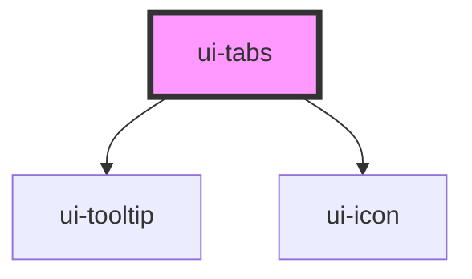

# ui-tabs

<!-- Auto Generated Below -->

## Properties

| Property             | Attribute              | Description | Type        | Default     |
| -------------------- | ---------------------- | ----------- | ----------- | ----------- |
| `activeIndex`        | `active-index`         |             | `number`    | `undefined` |
| `customTooltipClass` | `custom-tooltip-class` |             | `string`    | `undefined` |
| `defaultActiveIndex` | `default-active-index` |             | `number`    | `0`         |
| `scrollable`         | `scrollable`           |             | `boolean`   | `false`     |
| `tabs`               | --                     |             | `TabItem[]` | `[]`        |
| `tagColor`           | `tag-color`            |             | `string`    | `undefined` |

## Events

| Event            | Description | Type                                                                                                                                                    |
| ---------------- | ----------- | ------------------------------------------------------------------------------------------------------------------------------------------------------- |
| `getSelectedTab` |             | `CustomEvent<{ key: string; label: string; content?: string \| HTMLElement; disabled?: boolean; icon?: string; tooltip?: string; tagColor?: string; }>` |
| `getTabIndex`    |             | `CustomEvent<number>`                                                                                                                                   |
| `tabIconClicked` |             | `CustomEvent<{ index: number; tab: TabItem; }>`                                                                                                         |

## Methods

### `changeTab(index: number) => Promise<void>`

#### Parameters

| Name    | Type     | Description |
| ------- | -------- | ----------- |
| `index` | `number` |             |

#### Returns

Type: `Promise<void>`

### `getHeader() => Promise<HTMLElement>`

#### Returns

Type: `Promise<HTMLElement>`

## Dependencies

### Depends on

- [ui-tooltip](../ui-tooltip)
- [ui-icon](../ui-icon)

### Graph

----------------------------------------------

*Built with [StencilJS](https://stenciljs.com/)*
