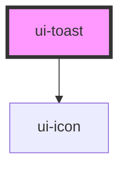

# ui-toast

<!-- Auto Generated Below -->

## Properties

| Property          | Attribute          | Description | Type      | Default |
| ----------------- | ------------------ | ----------- | --------- | ------- |
| `defaultDuration` | `default-duration` |             | `number`  | `4000`  |
| `maxVisible`      | `max-visible`      |             | `number`  | `4`     |
| `pauseOnHover`    | `pause-on-hover`   |             | `boolean` | `true`  |
| `stackGap`        | `stack-gap`        |             | `number`  | `10`    |
| `swipeDismiss`    | `swipe-dismiss`    |             | `boolean` | `false` |

## Events

| Event        | Description | Type                                |
| ------------ | ----------- | ----------------------------------- |
| `toastClose` |             | `CustomEvent<ToastLifecycleDetail>` |
| `toastShow`  |             | `CustomEvent<ToastLifecycleDetail>` |

## Methods

### `dismiss(id?: string) => Promise<void>`

#### Parameters

| Name | Type     | Description |
| ---- | -------- | ----------- |
| `id` | `string` |             |

#### Returns

Type: `Promise<void>`

### `show(options: ToastShowOptions) => Promise<string>`

#### Parameters

| Name      | Type               | Description |
| --------- | ------------------ | ----------- |
| `options` | `ToastShowOptions` |             |

#### Returns

Type: `Promise<string>`

## Dependencies

### Depends on

- [ui-icon](../ui-icon)

### Graph

----------------------------------------------

*Built with [StencilJS](https://stenciljs.com/)*
