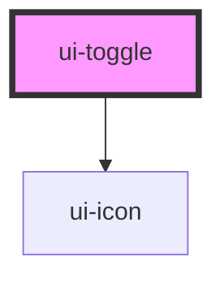

# ui-toggle

<!-- Auto Generated Below -->

## Properties

| Property         | Attribute         | Description | Type                   | Default     |
| ---------------- | ----------------- | ----------- | ---------------------- | ----------- |
| `checked`        | `checked`         |             | `boolean`              | `undefined` |
| `defaultChecked` | `default-checked` |             | `boolean`              | `false`     |
| `disabled`       | `disabled`        |             | `boolean`              | `false`     |
| `size`           | `size`            |             | `"lg" \| "md" \| "sm"` | `'md'`      |

## Events

| Event          | Description | Type                   |
| -------------- | ----------- | ---------------------- |
| `toggleChange` |             | `CustomEvent<boolean>` |

## Dependencies

### Depends on

- [ui-icon](../ui-icon)

### Graph

----------------------------------------------

*Built with [StencilJS](https://stenciljs.com/)*
