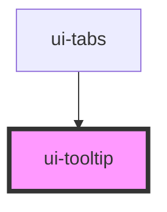

# ui-tooltip

<!-- Auto Generated Below -->

## Properties

| Property   | Attribute  | Description | Type                                     | Default     |
| ---------- | ---------- | ----------- | ---------------------------------------- | ----------- |
| `content`  | `content`  |             | `string`                                 | `undefined` |
| `delay`    | `delay`    |             | `number`                                 | `150`       |
| `disabled` | `disabled` |             | `boolean`                                | `false`     |
| `open`     | `open`     |             | `boolean`                                | `undefined` |
| `position` | `position` |             | `"bottom" \| "left" \| "right" \| "top"` | `'top'`     |
| `trigger`  | `trigger`  |             | `"click" \| "focus" \| "hover"`          | `'hover'`   |
| `variant`  | `variant`  |             | `"complex" \| "simple"`                  | `'simple'`  |

## Events

| Event        | Description | Type                   |
| ------------ | ----------- | ---------------------- |
| `openChange` |             | `CustomEvent<boolean>` |

## Dependencies

### Used by

 - [ui-tabs](../ui-tabs)

### Graph

----------------------------------------------

*Built with [StencilJS](https://stenciljs.com/)*
